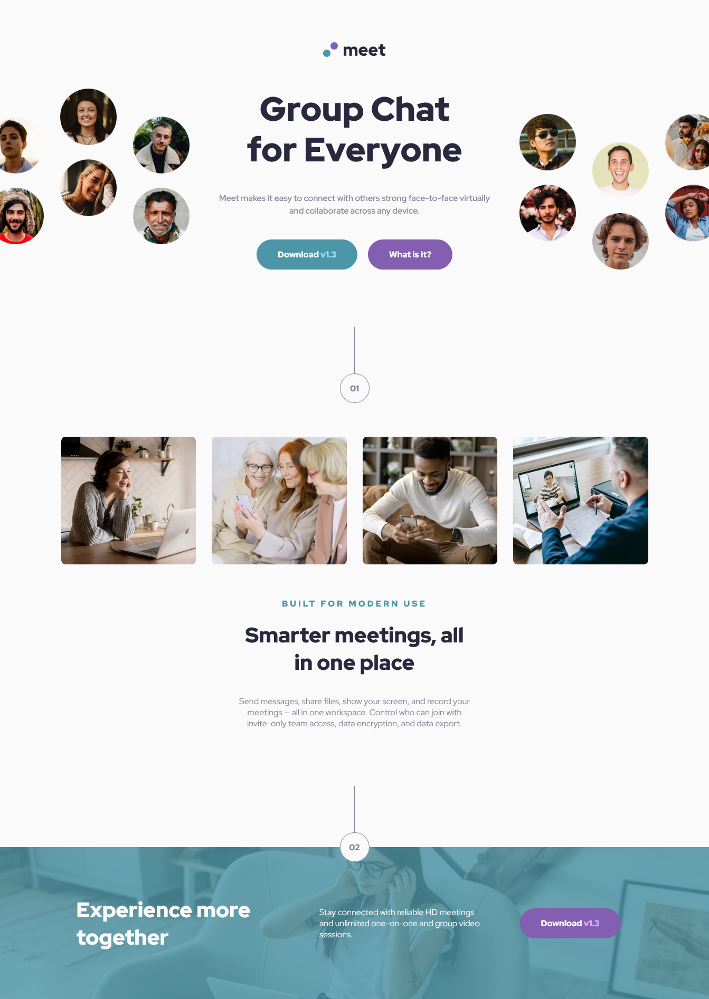

# Frontend Mentor - Meet landing page solution

### Screenshot
##Desktop Screenhot

##Tablet Screenshot

##Mobile Screenshot

### Links

- Solution URL: [Solution](https://github.com/tugcekizildg/Meet_Landing_Page_Challenge_FrontendMentor.io)
- Live Site URL: [Live Site](https://669c342152b089cf54c88481--polite-frangollo-1d2a84.netlify.app)

## My process

### Built with

- Semantic HTML5 markup
- CSS custom properties
- Flexbox
- CSS Grid
- Responsive Design 

## Author

- Website - [tugcekizildg](https://github.com/tugcekizildg)
- Frontend Mentor - [@tugcekizildg](https://www.frontendmentor.io/profile/tugcekizildg)

